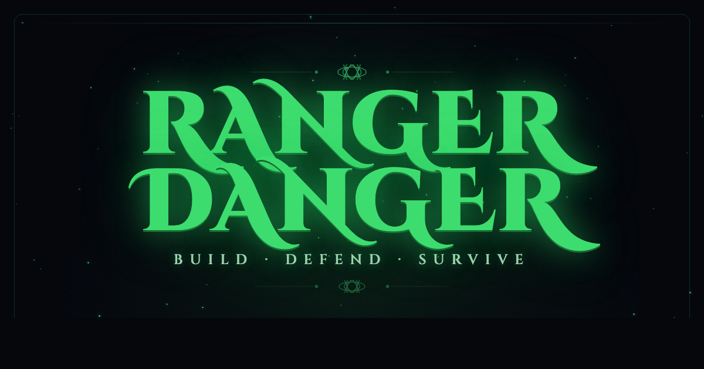

# Ranger Danger



A top-down 2D tower defense / action hybrid built with **Phaser 3 + TypeScript + Vite**. Most pixel art is procedurally generated in code; the level select map and a few tower bases are external sprites.

**Play it live:** https://rangerdanger.xyz
**Follow development:** [@ZakAgain](https://twitter.com/ZakAgain)

## Run it

```bash
npm install
npm run dev
```

Then open the printed localhost URL and hit **PLAY**.

## Controls

- **WASD / Arrow keys** — move
- **Stand still** — auto-shoots nearest enemy in range (half speed while moving)
- **1** — Arrow Tower
- **2** — Cannon Tower (locked on the meadow, unlocks from the forest on)
- **3** — Mage Tower (locked, coming soon)
- **4** — Wall
- **5 / SPACE** — cycle game speed
- **Click** — place on grid (ghost tints green/red for valid/invalid)
- **Click an existing wall** — start the 3-second sell countdown
- **Click a tower → SELL** — same countdown for towers (game resumes immediately)
- **ESC / B / SPACE** — cancel build mode

## Gameplay

- Survive waves of enemies across multiple biomes.
- Build arrow towers, cannon towers (with splash damage), and walls to funnel and kill enemies.
- Towers auto-target the nearest enemy in range; enemies path toward the player.
- Between waves, a build break timer lets you reposition defenses.
- After clearing the wave bar, a boss spawns — defeat it to earn a medal and unlock the next level.
- Selling a wall or tower starts a 3s red-pie countdown so you can't yank a structure out from under enemies mid-attack. Bosses can blow through both walls and towers — keep an eye on HP bars.

## Towers

- **Arrow Tower** — 60g, fast single-target, 3 upgrade tiers
- **Cannon Tower** — 60g, slower with splash AoE, 3 upgrade tiers
- **Wall** — 3g, cheap blocker for funneling (refunds 2g on sell)

## Levels & Biomes

Progress through levels on a Kingdom Rush-style map. Each level has 4 difficulty tiers (Easy / Medium / Hard / 1 HP) with medals. Levels unlock sequentially.

- **The Meadow** — green fields, basic goblins / heavies / runner packs. Boss: **The Ancient Ram**.
- **Forest** — pine forest with tree obstacles. Wolves, spiders, bears + cannon tower unlock. Boss: **The Wendigo**.
- **Infected Lands** — corrupted purple/green terrain with infected variants and **toads** (first ranged enemy — arc globs over walls). Boss: **The Blighted One**.
- **Rivers** — animated river map with flying enemies (crows, bats, dragonflies) and **mosquitoes** that fire darts blocked by walls/towers. Boss: **The Fog Phantom**.
- **The Castle** — flagstone fortress with skeletons, warlocks, golems, shadow imps, and castle bats. **Two bosses**: the **Phantom Queen** mid-boss (teleports, fires orb bursts, slow structure-damaging aura) and the **Castle Dragon** finale (spawns skeletons, lobs splash fireballs that hit structures 5× harder than the player).

## Up Next

Roadmap items, in no particular order:

- **Pixel art overhaul** — spend more time on AI pixel sprite page generators to lift the overall art quality.
- **Persistent storage** — move progress off `localStorage` so clearing the cache doesn't wipe medals / unlocks.
- **Co-Op Mode** — more enemies, shared gold, more excitement.
- **Menu / Settings screen** — volume, controls, accessibility, save management.
- **Build out remaining biomes** with new enemy styles and attacks; more variety needed in enemies overall.
- **Boss variety and attacks** — more attack patterns and unique mechanics per biome.
- **Character upgrades** — spend coins to upgrade movement speed, attack speed, attack power.
- **Player experience levels** — unlock upgrades as you play more. Gauge how the player did on a specific level and award XP for that plus convert any remaining coins to XP.
- **Multiple characters** — different heroes besides Ranger, each with stat upgrades. Examples: −10% tower price for Engineer, +10% attack speed for Ranger, etc.
- **Leaderboard** — score-based ranking per level per difficulty.
- **QoL updates** — ongoing UX polish.
